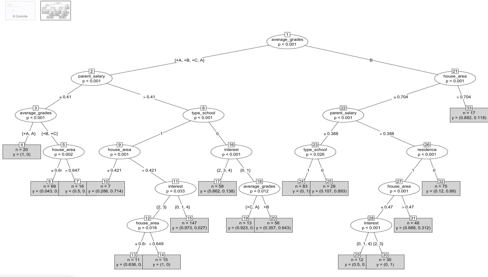
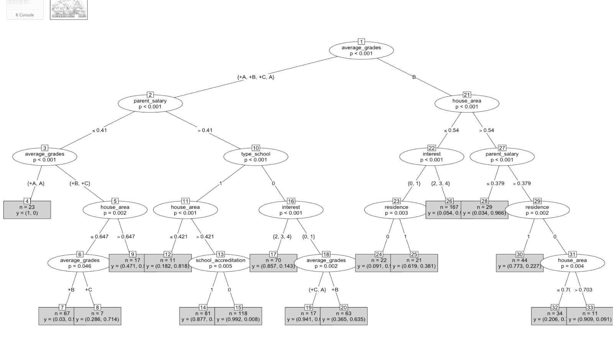
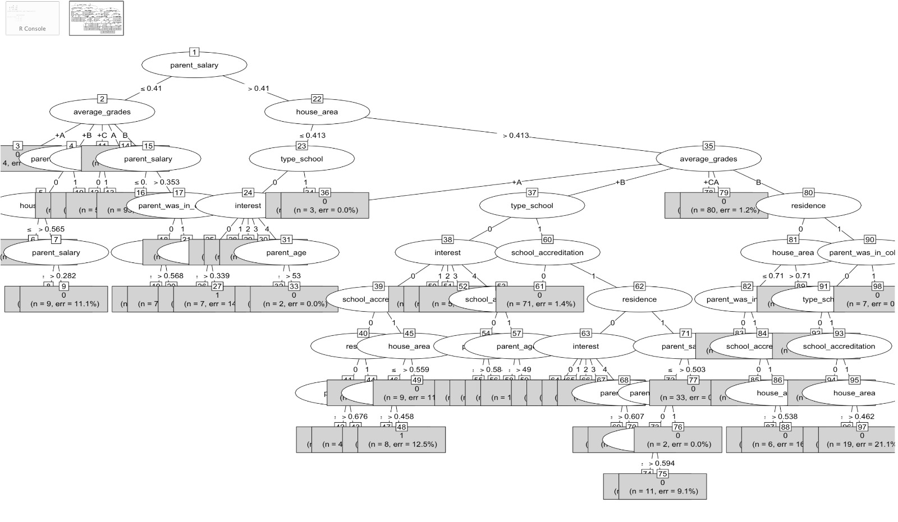
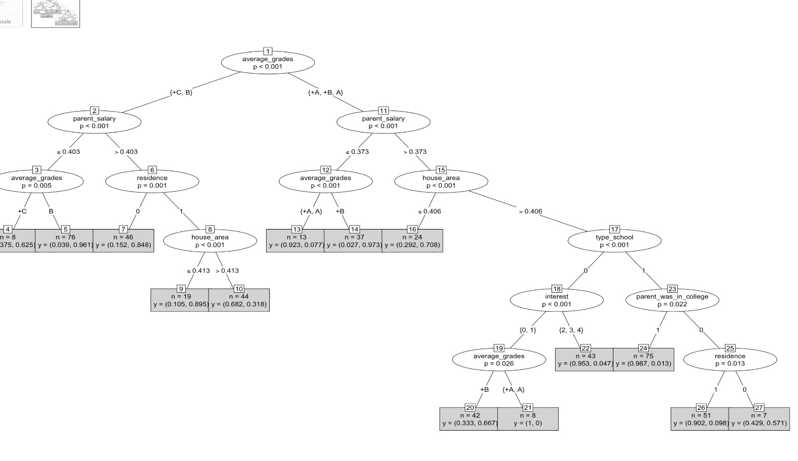
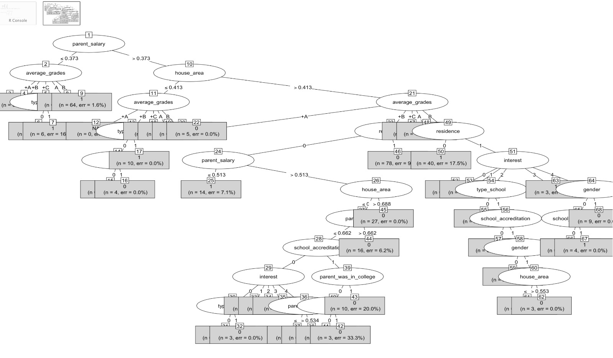

Important packages:

```{r}
setwd("Dataset")
Dataset <- read.csv("data.csv")
Preprocessed_dataset <-  read.csv("preprocessed_dataset.csv") 
if(!require(ggplot2)){
install.packages("ggplot2")}
library(ggplot2)
if(!require(dplyr)){
install.packages("dplyr")}
library(dplyr) 
if(!require(dplyr)){
install.packages("dplyr")}
library(dplyr)
if(!require(ltm)){
install.packages("ltm")}
library(ltm)
if (!require(cluster, quietly = TRUE)) {
  install.packages("cluster")
}
if (!require(factoextra, quietly = TRUE)) {
  install.packages("factoextra")
}
 
if (!require(caret, quietly = TRUE)) {
  install.packages("caret")
}

if (!require(partykit, quietly = TRUE)) {
  install.packages("partykit")
}

if (!require(rpart, quietly = TRUE)) {
  install.packages("rpart")
}
if (!require(rpart.plot, quietly = TRUE)) {
  install.packages("rpart.plot")
}
if (!require(tidyverse, quietly = TRUE)) {
  install.packages("tidyverse")
}
 
```

# IT326 Project {style="color: gray"}

\_\_\_\_\_\_\_\_\_\_\_\_\_\_\_\_\_\_\_\_\_\_\_\_\_\_\_\_\_\_\_\_\_\_\_\_\_\_\_\_\_\_\_\_\_\_\_\_\_\_\_\_\_\_\_\_\_\_\_\_\_\_\_\_\_\_\_\_\_\_\_\_\_\_\_\_\_\_\_\_\_\_\_\_\_\_\_\_\_\_\_\_\_\_\_\_\_\_\_\_\_\_\_\_\_

## The Goal

Our primary objective of this analysis is to classify whatever a student will go to college or not using the classification methods and to identify the main factors and reasons why students are less likely to pursue higher education indicated by "will_go_to_college" being 'False'. By leveraging the provided dataset with attributes such as school type, school accreditation, gender, interest in college, residence, we aim to discover the most influential variables and their relationships with the decision not to attend college.

## The Source

Kaggle.com

## URL :

<https://www.kaggle.com/datasets/saddamazyazy/go-to-college-dataset>

## General information

-   Number of attributes : 11
-   Number of rows (objects) : 1000
-   The class label: The class label in our project is the attribute "will_go_to_college". This attribute is binary, meaning that it can take on two values: True for yes or False for no. The value of this attribute will be the target variable that we are trying to predict during our project.

------------------------------------------------------------------------

+-----------------------+------------------------------------------------------------+-----------+---------------------------------------------------------------------------+
| Attribute             | Description                                                | Type      | Possible values                                                           |
+-----------------------+------------------------------------------------------------+-----------+---------------------------------------------------------------------------+
| type_school           | The type of school the student attends                     | Binary    | Academic / Vocational                                                     |
+-----------------------+------------------------------------------------------------+-----------+---------------------------------------------------------------------------+
| school_accreditation  | The quality if school                                      | Binary    | A / B (A is better than B)                                                |
+-----------------------+------------------------------------------------------------+-----------+---------------------------------------------------------------------------+
| gender                | The student's gender                                       | Binary    | Male / Female                                                             |
+-----------------------+------------------------------------------------------------+-----------+---------------------------------------------------------------------------+
| interest              | The student's interest in going to college                 | Nominal   | Very interested /Interested / Less Interested / Not Interested /Uncertain |
+-----------------------+------------------------------------------------------------+-----------+---------------------------------------------------------------------------+
| residence             | The student's residence                                    | Binary    | Urban / Rural                                                             |
+-----------------------+------------------------------------------------------------+-----------+---------------------------------------------------------------------------+
| parent_age            | The age of the student's parents                           | Numeric   | 40 - 65                                                                   |
+-----------------------+------------------------------------------------------------+-----------+---------------------------------------------------------------------------+
| parent_salary         | The monthly salary of the student's parents in IDR/Rupiah. | Numeric   | 1000K - 10M                                                               |
|                       |                                                            |           |                                                                           |
|                       | [1Rupiah = 0.00024SAR]                                     |           |                                                                           |
+-----------------------+------------------------------------------------------------+-----------+---------------------------------------------------------------------------+
| house_area            | The size of the student's house in meter square            | Numeric   | 20 - 120                                                                  |
+-----------------------+------------------------------------------------------------+-----------+---------------------------------------------------------------------------+
| average_grades        | The student's average grades in school.                    | Numeric   | 75 - 98                                                                   |
+-----------------------+------------------------------------------------------------+-----------+---------------------------------------------------------------------------+
| parent_was_in_college | Whether the student's parents attended college.            | Binary    | True - False                                                              |
+-----------------------+------------------------------------------------------------+-----------+---------------------------------------------------------------------------+
| will_go_to_college    | Whether the student plans to go to college.                | Binary    | True - False                                                              |
+-----------------------+------------------------------------------------------------+-----------+---------------------------------------------------------------------------+

## Sample of our data

```{r}
head(Dataset)
```

Here are a sample of 6 row from our dataset.

## Missing values

```{r}
sum(is.na(Dataset))
```

There are no missing values in our dataset.

## Statistical graphs

Graph 1:

```{r}
df =data.frame(Dataset)
ggplot(data=df, aes(x = interest, fill = will_go_to_college)) +
  geom_bar() +
  scale_x_discrete(limits = c('Not Interested', 'Less Interested', 'Uncertain', 'Interested', 'Very Interested')) +
  labs(title = 'College interest vs College attendance ') +
  scale_fill_manual(values = c("True" = "antiquewhite2", "False" = "antiquewhite3")) +
  theme_minimal()


```

According to the graph, whether students are interested in going to college or not does not affect whether they actually end up attending Collage . There is a group of individuals who were interested in attending but did not receive acceptance, while others who were not interested were accepted.

Graph 2:

```{r}

filtered_True =filter(Dataset, will_go_to_college == 'True')
filtered_False =subset(Dataset, will_go_to_college =='False')

ggplot() +
  geom_density(data = filtered_True, aes(x = average_grades, fill = "Going to College"), alpha = 0.5) +
  geom_density(data = filtered_False, aes(x = average_grades, fill = "NOT Going to College"), alpha = 0.5) +
  labs(x = "Average Grades", y = "Density") +
  ggtitle("Comparison of Average Grades for Students Going to College and NOT Going to College") +
  scale_fill_manual(values = c("Going to College" = "antiquewhite4", "NOT Going to College" = "antiquewhite1"))

```

The graph shows that the average grades for students who had accepted to go to college were higher than those who did not enter college , and this indicates the existence of a correlation between those who going to college and the average grades

Graph 3:

```{r}
Dataset_percentage <- Dataset %>%
  group_by(type_school) %>%
  summarise(percentage = mean(will_go_to_college == "True") * 100)

# Create a percentage chart
ggplot(Dataset_percentage, aes(x = type_school, y = percentage, fill = type_school)) +
  geom_bar(stat = "identity") +
  labs(title = "Percentage of Students Going to College by Type of School",
       x = "Type of School",
       y = "Percentage") +
  scale_fill_manual(values = c("Academic" = "antiquewhite3", "Vocational" = "antiquewhite2")) +
  theme_minimal()

 
```

This graph shows the impact of the type of high school attended by students on their college attendance . Based on the bar chart:

-   among students from Academic high schools, 313 are going to college, and 296 are not.

-   among students from Vocational high schools, 187 are going to college, and 204 are not

These information tell us that a higher proportion of students from academic high schools are going to college compared to those from vocational schools which suggest that the type of school attended.

Graph 4:

```{r}
ggplot(Dataset, aes(x = average_grades)) +
  geom_histogram(binwidth = 5, fill = "antiquewhite2", color = "antiquewhite4") +
  labs(title = "Distribution of students' grades",
       x = "Students' average grades",
       y = "Frequency") +
  theme_minimal()
```

This histogram show us that the majority of the students in the dataset are performing well since it seems like their grades are spanning between 75 and 98. This analysis will help us determine whether the academic performance level of students is a contributing factor to their college attendance or not.

## Statistical Measures

1.  The student's academic performance analysis:

```{r}
summary(Dataset$average_grades)

```

The student grades in our dataset range from 75.00 to 98.00, with a median of 85.58 and an average of 86.10. This suggests that most students are doing well as none of them have average grades below 50. However, it's interesting to note that some students have much higher or lower grades than the average, mainly due to the wide range of grades..

2.  The socioeconomic status of students' families analysis:

```{r}
summary(Dataset$parent_salary)
```

In the dataset, we've got students parents with salaries ranging from 1,000,000 to 10,000,000 IDR/Rupiah. The median salary is 5,440,000 IDR/Rupiah, and the average is 5,381,570 IDR/Rupiah. This data tells us that many parents in our dataset earn less than the average salary in Indonesia, which is 146,000,000 IDR. This suggests that quite a few students in our dataset come from families with limited finances. And this financial situation could certainly impact their ability to get through college.

```{r}
summary(Dataset$house_area)
```

Additionally we can utilize the house area attribute to gain a deeper understanding of the socioeconomic status of students' families, where students with houses significantly larger than the mean might indicate a higher socioeconomic status, while those with houses considerably smaller than the mean might reflect a comparatively lower socioeconomic status. Based on the shown output, the house areas range from [20.00-120.00 ㎡]. The median house area is 75.50 ㎡ indicates that families with house areas around this value likely have moderate socioeconomic status with houses that neither very small nor very large.

3.  Understanding Parent Age Range and Variation in its Values

```{r}
summary(Dataset$parent_age)
SD=sd(Dataset$parent_age)
MeanAge=mean(Dataset$parent_age)
cat("coefficient of variation:",SD/MeanAge*100,"%")

```

This summary provides the range for age attribute [40,65] which indicates that all parent in middle age during this age parent have more concern about their children , the coefficient of variation= 6.7% which indicates lower variation ,and the value of attribute parent_agerare are relatively close to the mean overall 25% of them have an age below or equal to 50 , 75% have an age below or equal to 54 and the median value is 52

## Outliers analysis

```{r}
###parent age outliers
quartiles <- quantile(Dataset$parent_age, probs=c(.25, .75), na.rm = FALSE)
IQR <- IQR(Dataset$parent_age)

Lower <- quartiles[1] - 1.5*IQR
Upper <- quartiles[2] + 1.5*IQR 

data_no_outlier <- subset(Dataset, Dataset$parent_age > Lower & Dataset$parent_age < Upper)
dim(data_no_outlier)

###parent salary outliers
quartiles <- quantile(Dataset$parent_salary, probs=c(.25, .75), na.rm = FALSE)
IQR <- IQR(Dataset$parent_salary)

Lower <- quartiles[1] - 1.5*IQR
Upper <- quartiles[2] + 1.5*IQR 

data_no_outlier <- subset(data_no_outlier, data_no_outlier$parent_salary> Lower & data_no_outlier$parent_salary < Upper)
dim(data_no_outlier)


###averge grades outliers
quartiles <- quantile(Dataset$average_grades, probs=c(.25, .75), na.rm = FALSE)
IQR <- IQR(Dataset$average_grades)

Lower <- quartiles[1] - 1.5*IQR
Upper <- quartiles[2] + 1.5*IQR 

data_no_outlier <- subset(data_no_outlier, data_no_outlier$average_grades> Lower & data_no_outlier$average_grades < Upper)
dim(data_no_outlier)


###house area outliers
quartiles <- quantile(Dataset$house_area, probs=c(.25, .75), na.rm = FALSE)
IQR <- IQR(Dataset$house_area)

Lower <- quartiles[1] - 1.5*IQR
Upper <- quartiles[2] + 1.5*IQR 

data_no_outlier <- subset(data_no_outlier, data_no_outlier$house_area> Lower & data_no_outlier$house_area < Upper)

Founded_Outliers=data.frame(anti_join(Dataset,data_no_outlier))
print(Founded_Outliers)
```

After conducting data analysis and identifying outliers, our inspection reveals that the detected outliers represent inherent variation within the population. Regarding Parent_age, outliers are observed for values below 44 and above 65. However, it should be noted the age from 40 to 65 fall within the expected mean of our dataset meaning that it doesn't indicate that they are outliers . For parent_salary, we found two outliers: one below 1,326,250 ind ≈ 85 USD and another above 9,416,250 ind ≈ 606 USD. The minimum and maximum values were determined to be 1,000,000 ind ≈ 64 USD and 10,000,000 ind ≈ 644 USD, respectively. In the case of grades, twelve outliers were identified, ranging from below 76 to above 97. Nevertheless, since the data falls within the acceptable range of 0 to 100, these outliers should be retained as they are still considered normal and within the usual grade range. Finally, for house_area, we found eleven outliers below 34.4m and above 115m, with the minimum being 20m and the maximum being 120m. However, these values are still considered typical for the population.

## Normalization

```{r}
normalize <- function(x) {return((x-min(x))/ (max(x)-min(x)))}
datasetWithoutNormalization<-Dataset
Dataset$parent_salary<-normalize(datasetWithoutNormalization$parent_salary)
Dataset$house_area<-normalize(datasetWithoutNormalization$house_area)
print(Dataset)
```

We applied normalization to the 'parent_salary' and 'house_area' attributes, scaling their values to a range between 0 and 1. This normalization process greatly facilitates data handling and analysis, ensuring that these attributes are on a consistent scale. Which will improve the reliability of our data analysis and enable better conclusions to be drawn from the dataset. Normalization is a crucial step in preparing the data for modeling, as it prevents attributes with larger numerical ranges from dominating the analysis and ensures fair treatment for all features.

## Discretization

```{r}


Dataset$average_grades [Dataset$average_grades >= 95] <- '+A'
Dataset$average_grades [95 >Dataset$average_grades & Dataset$average_grades >= 90] <- 'A'
Dataset$average_grades [90 >Dataset$average_grades & Dataset$average_grades >= 85] <- '+B'
Dataset$average_grades [85 >Dataset$average_grades & Dataset$average_grades >= 80] <- 'B'
Dataset$average_grades [80 >Dataset$average_grades & Dataset$average_grades >= 75] <- '+C'
Dataset$average_grades [75 >Dataset$average_grades & Dataset$average_grades >= 70] <- 'C'
Dataset$average_grades [70 >Dataset$average_grades & Dataset$average_grades >= 65] <- '+D'
Dataset$average_grades [65 >Dataset$average_grades & Dataset$average_grades >= 60] <- 'D'
Dataset$average_grades [60 >Dataset$average_grades & Dataset$average_grades >= 0] <- 'F'
Dataset$average_grades <- as.character(Dataset$average_grades )
print(Dataset)
```

We transformed the parent_age attribute into intervals by dividing the values to be fall on one of two possible interval labels with equal width which is(40,50],(50,60] by discretization the values well be simpler to classify or perform other methods that can help us later in our model.

and to better utilize and interpret the grades attributes for each student, we have converted the numeric grades into letter grades (A+, A, B+, B, C+, C, D+, D, F). This transformation was undertaken to focus on the general letter grade representation rather than the precise numerical values.

## Encoding

```{r}
Dataset$parent_was_in_college[Dataset$parent_was_in_college=="TRUE"]<-1
Dataset$parent_was_in_college[Dataset$parent_was_in_college=="True"]<-1
Dataset$parent_was_in_college[Dataset$parent_was_in_college=="FALSE"]<-0
Dataset$parent_was_in_college[Dataset$parent_was_in_college=="False"]<-0

Dataset$will_go_to_college[Dataset$will_go_to_college=="TRUE"]<-0
Dataset$will_go_to_college[Dataset$will_go_to_college=="True"]<-0
Dataset$will_go_to_college[Dataset$will_go_to_college=="FALSE"]<-1
Dataset$will_go_to_college[Dataset$will_go_to_college=="False"]<-1

Dataset$gender[Dataset$gender=="Female"]<-1
Dataset$gender[Dataset$gender=="Male"]<-0

Dataset$school_accreditation[Dataset$school_accreditation=="A"]<-1
Dataset$school_accreditation[Dataset$school_accreditation=="B"]<-0

Dataset$interest[Dataset$interest=="Very Interested"]<-4
Dataset$interest[Dataset$interest=="Interested"]<-3
Dataset$interest[Dataset$interest=="Less Interested"]<-2
Dataset$interest[Dataset$interest=="Not Interested"]<-1
Dataset$interest[Dataset$interest=="Uncertain"]<-0


Dataset$type_school[Dataset$type_school=="Academic"]<-1 
Dataset$type_school[Dataset$type_school=="Vocational"]<-0

Dataset$residence[Dataset$residence=="Urban"]<-1
Dataset$residence[Dataset$residence=="Rural"]<-0
print(Dataset)
```

Since encoding is an important step in data preprocessing that enables the use of categorical data in various data analysis and machine learning tasks, we encoded attributes like the 'parent was in college' attribute from (True, False) to (1, 0), and 'will go to college' from (True, False) to (0, 1). This encoding is carried out as we aim to predict the influencing factors. Additionally, we encoded the 'gender' attribute from (Female, Male) to (1, 0), 'school accreditation' from (A, B) to (1, 0), 'type_school' from (Academic, Vocational) to (1, 0), 'residence' from (Urban, Rural) to (1, 0), and 'interest' from (Very interested ,Interested , Less Interested , Not Interested ,Uncertain ) to (4,3,2, 1, 0) respectively. Encoding serves to simplify the data, reduce complexity, and enhance its suitability for modeling purposes.

## Correlation analysis Chi square test for nominal attribute:

```{r}

#1
C=chisq.test(Dataset$type_school , Dataset$will_go_to_college)
print(C)
#2

C=chisq.test(Dataset$school_accreditation , Dataset$will_go_to_college)
print(C)
#3
C=chisq.test(Dataset$gender , Dataset$will_go_to_college)
print(C)
#4
C=chisq.test(Dataset$interest , Dataset$will_go_to_college)
print(C)

#5
C=chisq.test(Dataset$residence , Dataset$will_go_to_college)
print(C)

#6
C=chisq.test(Dataset$average_grades , Dataset$will_go_to_college)
print(C)

#7
C=chisq.test(Dataset$parent_was_in_college , Dataset$will_go_to_college)
print(C)
```

All the attributes have X-square greater than the p-value which indicate a some association with the class label; therefore we reject the null hypothesis

we noticed for 'interest' and 'average grade' the analysis shows that X-square is much larger than p-value indicate the significant association of the two attributes with the decision of the student to go to the collage or not

## Correlation coefficient analysis for numeric attribute:

```{r}

biserial.cor(Dataset$parent_salary,Dataset$will_go_to_college, c("all.obs", "complete.obs"), level = 1)
biserial.cor(Dataset$house_area,Dataset$will_go_to_college, c("all.obs", "complete.obs"), level = 1)
biserial.cor(Dataset$parent_age,Dataset$will_go_to_college,c("all.obs", "complete.obs"), level = 1)
 
 

```

the analysis shows moderate correlation coefficient for parent salary and house area with the class label which indicate that they are relevant factors meaning that the higher the parent salary and the larger house area the higher probability for a student to enroll in a collage

where is the on other hand, the correlation coefficient for the parent age is very small which indicate that the parent age has little impact to the probability for student to enroll in a collage

## Feature selection:

ultimately based on the analysis of the correlation that we conducted on the relationship of the dataset attributes with the class label, and the understanding of the data and the context of each attribute and potential relevance to the class label we decided to not delete any of the attribute

## Classification:

The attribute selection measure is a heuristic technique employed to select the most optimal criteria for dividing a collection of data tuples into partitions that are as pure as possible. Several attribute selection measures are commonly utilized, such as Information Gain (ID3), Gain Ratio (C4.5), and Gini Index (CART). we will constraints for Each of these measures different partitions by dividing them in ratios of 50%-50%, 70%-30%, and 80%-20%.

### factor the data

```{r}


data<-Preprocessed_dataset
data$will_go_to_college <- as.factor(data$will_go_to_college)
data$residence <- as.factor(data$residence)
data$gender <- as.factor(data$gender)
data$parent_was_in_college <- as.factor(data$parent_was_in_college)
data$interest <- as.factor(data$interest)
data$type_school <- as.factor(data$type_school)
data$school_accreditation <- as.factor(data$school_accreditation)
data$average_grades <- as.factor(data$average_grades)

```

### balanced or imbalanced

```{r}

library(tidyverse) 
library(caret)
data$will_go_to_college<- as.numeric(data$will_go_to_college)
hist(data$will_go_to_college,col="coral")
prop.table(table(data$will_go_to_college))
```

we want to confirm that the distribution between the two label data is not too much different. Because imbalanced datasets can lead to imbalanced accuracy.

Fortunately ,our data is balanced

| **70% training, 30% testing** |
|-------------------------------|

```{r}
set.seed(123
         )
ind=sample(2, nrow(data), replace=TRUE, prob=c(0.70 , 0.30))
train_data=data[ind==1,]
test_data=data[ind==2,]
dim(train_data)
dim(test_data)
```

We partition the data the data into (70% training, 30% testing). This result in 705 object in the training set and 295 object in the testing set.

#### **information gain**

```{r}
library(party)
myFormula<- will_go_to_college~ + type_school+school_accreditation+gender+interest+residence+parent_age+parent_salary+house_area+average_grades+parent_was_in_college
dataset_ctree<-ctree(myFormula, data=train_data)

table(predict(dataset_ctree), train_data$will_go_to_college) 
plot(dataset_ctree,type="simple")
testPred <- predict(dataset_ctree, newdata = test_data)
result<-table(testPred, test_data$will_go_to_college )
library(caret)
co_result <- confusionMatrix(result, positive = "1")
print(co_result)
```



this matrix below show the evaluation model on testing data

| Evaluation method | Method |
|-------------------|--------|
| Accuracy          | 82.37% |
| Error rate        | 17.63% |
| Sensitivity       | 75.89% |
| Specificity       | 88.31% |
| Precision         | 85.60% |

average grade with the highest information gain is chosen as the root attribute.

#### **Gain ratio**

```{r}
library(RWeka)
C45Fit <- J48( will_go_to_college~.,data=train_data)
table(train_data$will_go_to_college, predict(C45Fit))
plot(C45Fit,type = "simple")
testPred <- predict(C45Fit, newdata = test_data)
results <- confusionMatrix(testPred, test_data$will_go_to_college, positive = "1")
print(results)
```


this matrix below show the evaluation model on testing data

| Evaluation method | Method |
|-------------------|--------|
| Accuracy          | 80.34% |
| Error rate        | 19.66% |
| Sensitivity       | 77.30% |
| Specificity       | 83.12% |
| Precision         | 80.74% |

Parent salary is chosen as the root due to its high Gain ratio

#### **Gini index**

```{r}
library(rpart)
library(rpart.plot)
cart_fit=rpart(will_go_to_college~., data=train_data, method="class",cp=0.008)


rpart.plot(cart_fit)

testPred<- predict(cart_fit,newdata=test_data,type="class")
results<- confusionMatrix(testPred,test_data$will_go_to_college,positive="1")
print(results)

```

this matrix below show the evaluation model on testing data

| Evaluation method | Method |
|-------------------|--------|
| Accuracy          | 79.66% |
| Error rate        | 20.34% |
| Sensitivity       | 78.01% |
| Specificity       | 81.17% |
| Precision         | 79.14% |

Parent salary is chosen as the root due to its high Gain index.

| 80% training, 20% testing |
|---------------------------|

```{r}
set.seed(123)
ind=sample(2, nrow(data), replace=TRUE, prob=c(0.80 , 0.20))
train_data=data[ind==1,]
test_data=data[ind==2,]
dim(train_data)
dim(test_data)
```

We partition the data the data into (80% training, 20% testing). This result in 802 object in the training set and 198 object in the testing set.

#### **information gain**

```{r}
library(party)
myFormula<- will_go_to_college~ + type_school+school_accreditation+gender+interest+residence+parent_age+parent_salary+house_area+average_grades+parent_was_in_college

dataset_ctree<-ctree(myFormula, data=train_data)
table(predict(dataset_ctree), train_data$will_go_to_college) 
plot(dataset_ctree,type="simple")
testPred <- predict(dataset_ctree, newdata = test_data)
result<-table(testPred, test_data$will_go_to_college )
library(caret)
co_result <- confusionMatrix(result,positive="1")
print(co_result)
```



this matrix below show the evaluation model on testing data

| Evaluation method | Method  |
|-------------------|---------|
| Accuracy          | 83.84 % |
| Error rate        | 16.16%  |
| Sensitivity       | 86.73%  |
| Specificity       | 81.00%  |
| Precision         | 81.73%  |

average grade with the highest information gain is chosen as the root attribute

#### **Gain ratio**

```{r}
library(RWeka)


C45Fit <- J48( will_go_to_college~.,data=train_data)
table(train_data$will_go_to_college, predict(C45Fit))

plot(C45Fit,type = "simple")
testPred <- predict(C45Fit, newdata = test_data)
results <- confusionMatrix(testPred, test_data$will_go_to_college, positive = "1")
print(results)
```



this matrix below show the evaluation model on testing data

| Evaluation method | Method |
|-------------------|--------|
| Accuracy          | 80.03% |
| Error rate        | 19.97% |
| Sensitivity       | 84.69% |
| Specificity       | 76.00% |
| Precision         | 77.57% |

Parent salary is chosen as the root due to its high purity which indicate high Gain ratio

#### **Gini index**

```{r}
library(rpart)
library(rpart.plot)
cart_fit=rpart(will_go_to_college~., data=train_data, method="class",cp=0.008)


rpart.plot(cart_fit)

testPred<- predict(cart_fit,newdata=test_data,type="class")
results<- confusionMatrix(testPred,test_data$will_go_to_college,positive="1")
print(results)

```

this matrix below show the evaluation model on testing data

| Evaluation method | Method |
|-------------------|--------|
| Accuracy          | 80.81% |
| Error rate        | 19.19% |
| Sensitivity       | 76.53% |
| Specificity       | 85.00% |
| Precision         | 83.33% |

house area is chosen as the root due to its high purity which indicate Gini index.

| 50% training, 50% testing |
|---------------------------|

```{r}
set.seed(123)
ind=sample(2, nrow(data), replace=TRUE, prob=c(0.50 , 0.50))
train_data=data[ind==1,]
test_data=data[ind==2,]
dim(train_data)
dim(test_data)

```

We partition the data the data into (50% training, 50% testing). This result in 493 object in the training set and 507 object in the testing set.

#### **information gain**

```{r}
library(party)
myFormula<- will_go_to_college~ + type_school+school_accreditation+gender+interest+residence+parent_age+parent_salary+house_area+average_grades+parent_was_in_college

dataset_ctree<-ctree(myFormula, data=train_data)
table(predict(dataset_ctree), train_data$will_go_to_college) 

plot(dataset_ctree,type="simple")
testPred <- predict(dataset_ctree, newdata = test_data)
result<-table(testPred, test_data$will_go_to_college )

library(caret)
co_result <- confusionMatrix(result, positive = "1")
print(co_result)

```



this matrix below show the evaluation model on testing data

| Evaluation method | Method |
|-------------------|--------|
| Accuracy          | 84.22% |
| Error rate        | 15.78% |
| Sensitivity       | 89.53% |
| Specificity       | 78.71% |
| Precision         | 81.34% |

average grade with the highest information gain is chosen as the root attribute.

#### **Gain ratio**

```{r}
library(RWeka)
C45Fit <- J48( will_go_to_college~.,data=train_data)
table(train_data$will_go_to_college, predict(C45Fit))
plot(C45Fit,type = "simple")
testPred <- predict(C45Fit, newdata = test_data)
results <- confusionMatrix(testPred, test_data$will_go_to_college, positive = "1")
print(results)

```



this matrix below show the evaluation model on testing data

| Evaluation method | Method |
|-------------------|--------|
| Accuracy          | 85.21% |
| Error rate        | 14.79% |
| Sensitivity       | 87.60% |
| Specificity       | 82.73% |
| Precision         | 84.01% |

Parent salary is chosen as the root due to its high purity which indicate high Gain ratio

#### **Gini index**

```{r}
library(rpart)
library(rpart.plot)
cart_fit=rpart(will_go_to_college~., data=train_data, method="class",cp=0.008)

rpart.plot(cart_fit)

testPred<- predict(cart_fit,newdata=test_data,type="class")
results<- confusionMatrix(testPred,test_data$will_go_to_college,positive="1")
print(results)
```

this matrix below show the evaluation model on testing data

| Evaluation method | Method |
|-------------------|--------|
| Accuracy          | 85.21% |
| Error rate        | 24.79% |
| Sensitivity       | 88.37% |
| Specificity       | 81.93% |
| Precision         | 83.52% |

: Average grades is chosen as the root due to its high purity which indicate Gini index.

## final analysis

#### information gain

Information Gain is a measure used in the ID3 algorithm for attribute selection in decision tree learning. It quantifies the amount of information obtained about the class variable when a given attribute is used to split the data. The Information Gain is calculated by substract the entropy Expected information needed to classify a tuple in D a with Conditional Entropy Information needed after using A to split D into v partitions, to classify D . A higher Information Gain indicates that the attribute is more informative and should be chosen as the splitting criterion.

for our trees,

average grade was chosen as the root attribute for all 3 trees with the highest information gain This attribute Reflects the least randomness or "impurity" in these partitions and guarantees that a simple tree is found.

|             | 50%-50% | 70%-30% | 80%-20% |
|-------------|---------|---------|---------|
| Accuracy    | 84.22%  | 82.37 % | 83.84 % |
| Error rate  | 15.78%  | 17.63%  | 16.16%  |
| Sensitivity | 89.53%  | 75.89%  | 86.73%  |
| Specificity | 78.71%  | 88.31%  | 81.00%  |
| Precision   | 81.34%  | 85.60%  | 81.73%  |

the evaluation method table shows that the best partiton for information gain shows that 50%-50% is the best model based on accuracy(tuples that are correctly classified) with precntages 84.22% and Sensitivity (True positive recognition rate) with 89.53% but the lowest Specificity(True negative recognition rate) with 78.71%. overall it's the best model for information gain has the lowest error rate 15.78%

#### gain ratio

Gain Ratio is an normaliztion for Information Gain and is used in the C4.5 algorithm, which is an extension of ID3. While Information Gain tends to favor attributes with many multivariate It is calculated by dividing the Information Gain by SplitInfo a(D).

for our trees,

Parent salary was chosen as the root attribute for all 3 trees due to its high Gain ratio, the trees split are unbalanced since gain ratio Tends to prefer unbalanced splits in which one partition is much smaller than the others

|             | 50%-50% | 70%-30% | 80%-20% |
|-------------|---------|---------|---------|
| Accuracy    | 85.21%  | 80.34%  | 80.03%  |
| Error rate  | 14.79%  | 19.66%  | 19.97%  |
| Sensitivity | 87.60%  | 77.30%  | 84.69%  |
| Specificity | 82.73%  | 83.12%  | 76.00%  |
| Precision   | 84.01%  | 80.74%  | 77.57%  |

the evaluation method table shows that the best partition for gain ratio shows that 50%-50% is the best model based on accuracy(tuples that are correctly classified) with percntages 85.21% and Sensitivity (True positive recognition rate) with 87.60% and Precision(tuples labeled as positive are actually positive) with percentages 84.01% but the lowest Specificity(True negative recognition rate) with 82.73%. overall it's the best model dor gain ratio with the lowest error rate 14.79%

#### gini index

Gini Index is a criterion used in the CART (Classification and Regression Trees) algorithm for attribute selection. It measures the impurity of a set of tuples, with lower values Gini a(D) indicating higher purity. The Gini Index is calculated by summing the squared probabilities of each class label in the set

for our trees,

gini index had different root (parent salary/house area/averages grades) for each tree

|             | 50%-50% | 70%-30% | 80%-20% |
|-------------|---------|---------|---------|
| Accuracy    | 85.21%  | 79.66%  | 80.81%  |
| Error rate  | 14.79%  | 20.34%  | 19.19%  |
| Sensitivity | 88.37%  | 78.01%  | 76.53%  |
| Specificity | 81.93%  | 81.17%  | 85.00%  |
| Precision   | 83.52%  | 79.14%  | 83.33%  |

the evaluation method table shows that the best partition for gain ratio shows that 50%-50% is the best model based on accuracy(tuples that are correctly classified) with percentages 85.21% and Sensitivity (True positive recognition rate) with 88.37% and Precision(tuples labeled as positive are actually positive) with percentages 83.52% overall it's the best model for gini index with the lowest error rate 14.79%

#### best model

the 50% training, 50% testing was the best partition for all attribute selection measures with accuracies 85.21%. for both gini index and gain ratio

Both attribute selection measures yield the same accuracy and error rate, so we need to check the remaining evaluation metrics that is provided:

|             | gain ratio | gini index |
|-------------|------------|------------|
| Accuracy    | 85.21%     | 85.21%     |
| Error rate  | 14.79%     | 14.79%     |
| Sensitivity | 87.60%     | 88.37%     |
| Specificity | 82.73%     | 81.93%     |
| Precision   | 84.01%     | 83.52%     |

Comparing the sensitivity, specificity, and precision:

\- Sensitivity: Gini Index has a higher sensitivity value (88.37%) compared to Gain Ratio (87.60%). Higher sensitivity indicates a better ability to correctly identify positive instances so **gini index is better regarding Sensitivity.**

\- Specificity: Gini Index has a lower specificity value (81.93%) compared to Gain Ratio (82.73%). Higher specificity indicates a better ability to correctly identify negative instances.

\- Precision: Gain Ratio has a higher precision value (84.01%) compared to Gini Index (83.52%). Higher precision indicates a better ability to correctly classify positive instances.

**so gain ratio is better regarding** **Specificity and Precision .**

Based on these comparisons, it is difficult to determine definitively which attribute selection measure is the best. The choice between Gini Index and Gain Ratio may depend on the specific requirements and priorities of the problem

our final trees are :


for gain ratio the parent's salary served as the root feature, indicating that the financial circumstances of the student are a crucial factor for contemporary universities.

for gini index the average grades served as the root feature, indicating that the grades are a crucial factor for contemporary universities.

## Clustering **Analysis:**

In this analysis, we apply K-means clustering to the dataset using different values of K. K-means clustering is an unsupervised learning algorithm that partitions the data into K clusters based on similarity. We will explore three different values of K and evaluate the clustering results using various metrics.

### Removing the class label and preparing the dataset for Clustering

```{r}
 
original_data <- Preprocessed_dataset

# Remove any non-numeric attributes
numeric_data <- original_data[, sapply(original_data, is.numeric)]

# Remove the class label 'will_go_to_college'
numeric_data <- numeric_data[, !(names(numeric_data) == 'will_go_to_college')]


# Print the dataset "numeric_data" to make sure it's prepared for clustering
print(numeric_data)

# Scaling the dataset
# numeric_data <- scale(numeric_data)

 
```

Now, the 'numeric_dataset' dataset contains only numeric attributes without the class label, which makes it ready for the clustering process.

## K=2

```{r}
# k-means clustering set a seed for random number generation to make the results reproducible 
set.seed(8953)

# run kmeans clustering to find 2 clusters
kmeans.result <- kmeans(numeric_data, 2)

# visualize clustering
library(factoextra)
fviz_cluster(kmeans.result, data = numeric_data)

# print the clustering result
print(kmeans.result)


```

#### The Silhouette coefficient

```{r}
#average for each cluster 
avg_sil <- silhouette(kmeans.result$cluster, dist(numeric_data)) 

#k-means clustering with estimating k and initializations 
fviz_silhouette(avg_sil)

```

#### The total within-cluster sum of squares

```{r}
# Calculate total within-cluster sum of squares
total_withinss <- kmeans.result$tot.withinss
cat("Total Within-Cluster Sum of Squares:", sum(total_withinss), "\n")

true_labels <- c(1, 1, 2, 1, 2, 2, 3, 3, 4, 4)  # Adjust based on your actual true labels

cluster_assignments <- kmeans.result$cluster
 
```

#### BCubed recall and precision

```{r}

# Calculate BCubed precision
precision <- 0
for (i in unique(true_labels)) {
  cluster_indices <- which(true_labels == i)
  precision <- precision + sum((table(cluster_assignments[cluster_indices]) * (table(cluster_assignments[cluster_indices]) - 1)) / sum(table(cluster_assignments[cluster_indices])))
}
precision <- precision / sum(table(cluster_assignments))

# Calculate BCubed recall
recall <- 0
for (j in unique(cluster_assignments)) {
  cluster_indices <- which(cluster_assignments == j)
  recall <- recall + sum((table(true_labels[cluster_indices]) * (table(true_labels[cluster_indices]) - 1)) / sum(table(true_labels[cluster_indices])))
}
recall <- recall / sum(table(true_labels))

cat("BCubed Precision:", precision, "\n")
cat("BCubed Recall:", recall, "\n")


```

## K=4

```{r}
# k-means clustering set a seed for random number generation to make the results reproducible 
set.seed(8953)

# run kmeans clustering to find 4 clusters
kmeans.result <- kmeans(numeric_data, 4)

# visualize clustering
library(factoextra)
fviz_cluster(kmeans.result, data = numeric_data)

# print the clustering result
print(kmeans.result)


```

#### The Silhouette coefficient

```{r}
#average for each cluster 
avg_sil <- silhouette(kmeans.result$cluster, dist(numeric_data)) 

#k-means clustering with estimating k and initializations 
fviz_silhouette(avg_sil)

```

#### The total within-cluster sum of squares

```{r}
# Calculate total within-cluster sum of squares
total_withinss <- kmeans.result$tot.withinss
cat("Total Within-Cluster Sum of Squares:", sum(total_withinss), "\n")

true_labels <- c(1, 1, 2, 1, 2, 2, 3, 3, 4, 4)  # Adjust based on your actual true labels

cluster_assignments <- kmeans.result$cluster
 
```

#### BCubed recall and precision

```{r}

# Calculate BCubed precision
precision <- 0
for (i in unique(true_labels)) {
  cluster_indices <- which(true_labels == i)
  precision <- precision + sum((table(cluster_assignments[cluster_indices]) * (table(cluster_assignments[cluster_indices]) - 1)) / sum(table(cluster_assignments[cluster_indices])))
}
precision <- precision / sum(table(cluster_assignments))

# Calculate BCubed recall
recall <- 0
for (j in unique(cluster_assignments)) {
  cluster_indices <- which(cluster_assignments == j)
  recall <- recall + sum((table(true_labels[cluster_indices]) * (table(true_labels[cluster_indices]) - 1)) / sum(table(true_labels[cluster_indices])))
}
recall <- recall / sum(table(true_labels))

cat("BCubed Precision:", precision, "\n")
cat("BCubed Recall:", recall, "\n")


```

## K=6

```{r}
# k-means clustering set a seed for random number generation to make the results reproducible 
set.seed(8953)

# run kmeans clustering to find 6 clusters
kmeans.result <- kmeans(numeric_data, 6)

# visualize clustering
library(factoextra)
fviz_cluster(kmeans.result, data = numeric_data)

# print the clustering result
print(kmeans.result)


```

#### The Silhouette coefficient

```{r}
#average for each cluster 
avg_sil <- silhouette(kmeans.result$cluster, dist(numeric_data)) 

#k-means clustering with estimating k and initializations 
fviz_silhouette(avg_sil)

```

#### The total within-cluster sum of squares

```{r}
# Calculate total within-cluster sum of squares
total_withinss <- kmeans.result$tot.withinss
cat("Total Within-Cluster Sum of Squares:", sum(total_withinss), "\n")

true_labels <- c(1, 1, 2, 1, 2, 2, 3, 3, 4, 4)  # Adjust based on your actual true labels

cluster_assignments <- kmeans.result$cluster
 
```

#### BCubed recall and precision

```{r}

# Calculate BCubed precision
precision <- 0
for (i in unique(true_labels)) {
  cluster_indices <- which(true_labels == i)
  precision <- precision + sum((table(cluster_assignments[cluster_indices]) * (table(cluster_assignments[cluster_indices]) - 1)) / sum(table(cluster_assignments[cluster_indices])))
}
precision <- precision / sum(table(cluster_assignments))

# Calculate BCubed recall
recall <- 0
for (j in unique(cluster_assignments)) {
  cluster_indices <- which(cluster_assignments == j)
  recall <- recall + sum((table(true_labels[cluster_indices]) * (table(true_labels[cluster_indices]) - 1)) / sum(table(true_labels[cluster_indices])))
}
recall <- recall / sum(table(true_labels))

cat("BCubed Precision:", precision, "\n")
cat("BCubed Recall:", recall, "\n")


```

### The optimal number of clusters

To find the optimal number of clusters to use in the k-means algorithm, we'll use the **fviz_nbclust()** function from the **factoextra**package to create a plot of the number of clusters vs. the total within sum of squares

```{r}
# Function to calculate total within-cluster sum of squares (wss)
wss <- function(k) {
  kmeans_result <- kmeans(numeric_data, centers = k, nstart = 10)  # You can adjust nstart based on your preference
  return(sum(kmeans_result$tot.withinss))
}

# Calculate the total within-cluster sum of squares for different values of k
k_values <- 1:10  # You can adjust the range of k values
wss_values <- sapply(k_values, wss)

# Plot the elbow curve
plot(k_values, wss_values, type = "b", pch = 19, frame = FALSE, 
     xlab = "Number of Clusters (k)", ylab = "Total Within-Cluster Sum of Squares (WSS)",
     main = "Elbow Method")

# Adding a line to indicate the "elbow"
abline(v = which(diff(wss_values) == max(diff(wss_values))) + 1, col = "red")


```

According to the output the best number of clusters is one,
